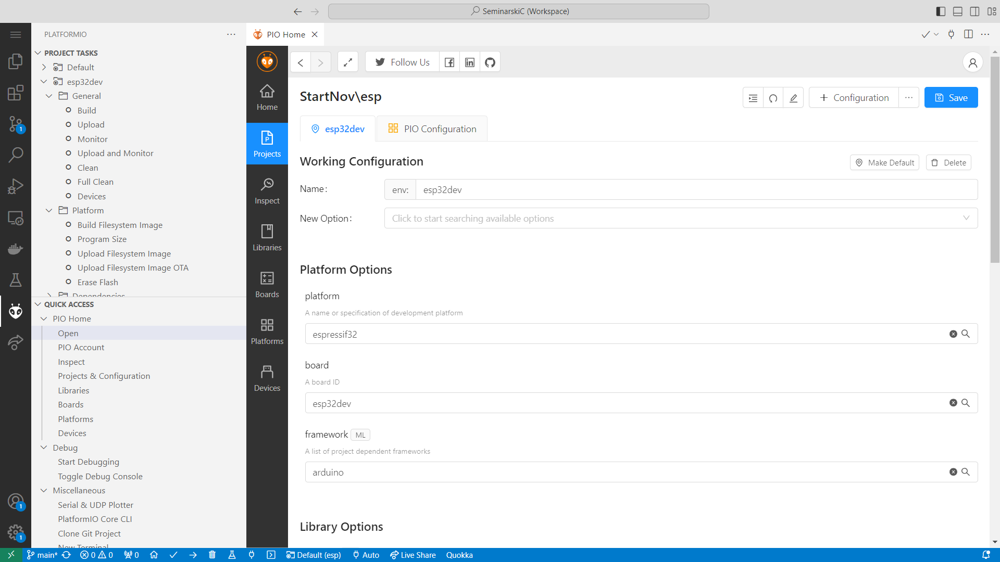

# Seminarski rad C - IOT uređaju

## Neophodan software

Za pokretanje porojekta je potreban [VS Code](https://code.visualstudio.com/). Nakon instalacije, za rad sa ESP32 potrebno je instalirati sledeće ekstenzije:
- [PlatformIO](https://marketplace.visualstudio.com/items?itemName=platformio.platformio-ide) - kompajlovanje i poveyivanje sa mikrokontrolerima.
- [C/C++](https://marketplace.visualstudio.com/items?itemName=ms-vscode.cpptools) - Syntax highlighting 

[Node.js](https://nodejs.org/en) (Opcionalno) - Pokretanje web aplikacije

## Neophodne komponente
1. ESP 32
2. 16x2 LCD display sa I2C konekcijom

ESP32 I2C konekcija se nalazi na pinovima 21 (SCL) i 22 (SDL) 

## Rad sa ESP32 mikrokontrolerom

Ekstenzija **PlatformIO** je odgovorna za organizaciju i poveziavanje sa ESP32. Ekstenzija nam nudi sve od kompajlovanja koda do kreacije više konfiguracije za više različitih kontolera. 

### Build i Upload

U levom menu se sad nalazi sekcija za PlatformIo. Klikom na `Upload` se kompajlije i uploduje kod na ESP32, ako je povezan.

### Framework i konfiguracija

Kod je konfigurisan da koristi `arduino` framework. ESP32 može takođe da korsit `espressif` framework koji daje programeru punu kontorlu nad konfiguracijom i radom procesora, ali zato gubi mogućnost upotrebe `arduino` biblioteka. 

Konfiguracija se nalazi u [platformio.ini](esp/platformio.ini). Može se menjati ručno u konfiguraciji ili preko PlatfromIO ekstenzije u UI-u.

Moje promene u konfiguraciji su:

- `board_build.partitions` Promenjena je veličina particija za [OTA updates](https://docs.platformio.org/en/latest/platforms/espressif32.html#over-the-air-ota-update) i SPIFFS. [Lista mogućih konfiguracija](https://github.com/espressif/arduino-esp32/tree/master/tools/partitions)

### Eksterne biblioteke 

PlatfromIO je odgovoran za podešavanje i skidanje potrebnih biblioteka. Sva podešavanja se nalaze u UI-u i konfiguraciji.

## Web aplikacija

Web aplikacija se nalazi na [iot.f.jovica.me](https://iot.f.jovica.me)
Nije nephodno lokalno pokretati sajt. Uputsvta za pokretanje se nalze u [README.MD](web/README.md)

### Kako radi aplikacije
Za renderovanje UI-a se koristi [solid.js](https://www.solidjs.com/). 

Aplikacija koristi [Web Bluetooth API](https://developer.mozilla.org/en-US/docs/Web/API/Web_Bluetooth_API) za povezivanje i komunikaciju sa ESP-em odnosno bilikojim BLE uređajem. API koji pretraživač daje je prost, tako da nema potreba za importovanjem dodatnih biblioteka. Kod relevantan za rad sa BLE nalazi se u [BLEStore.tsx](src/store/BLEStore.tsx)

`BLEStore.tsx` je napisan u Typescript-u, odnosno Javascript sa tipovina podataka. U fajlu se export-uju metode koje kontolišu konekciju `connect()`, `disconnect()`, `initBLE()`.

Kada se desi promena vresnosti neke GATT karakteristike, vrednosti se čuvaju u `BLEData` Solid.js prodavnici. Solid.js prodavnica nam omogućava da se svaka promena u vrednostima odmah vidi u UI, bez potrebe da ručno pišemo kod koji će da promeni UI.

Sa  malo promena kod može da se koristi sa bilokojim web UI frameworkom, kao React.js ili Angular

## ESP32 Kako rade biblioteke

U `main.cpp` fajlu se nalazi osnovni kod potreban za pokretanje svega. `BLEProvider` i `SerialProvider` su biblioteke koje moraju da se inicijalizuju pre glavnog koga `setup()`. Takoće na kraju `setup()`  je potrebno kreirati task-ove koji će proveravati BLE i seriski port.

### CommandService
Kod je zamišljen tako da programer može da pravi *komande*. Komande mogu da budu BLE ili seriske. Za seriske potrebno je dati ime komenade, dok za BLE je potrebno dati UUID. U svakoj komandi se daje callback funkcija koja je odgovorna za procesovanja char[] koji je korisnik dao toj komandi seriski ili preko BLE.

`CommandService` je odgovoran za organizaciju komandi. Na početku je potrebo reći koliko komandi može program da očekuje. Nakon toga programer može da `CommandService::add()` svoje BLE i seriske komande.

> `BLEProvider::turnOnService()` mora da se pozove nak dodavanje svih BLE komandi.

Progrmaer može da doda neke default vrednosti karakteristikama koje je definiso preko `BLEProvider::setValue(UUID, value);` nakon uključenje servisa. 

### StorageProvider
Je odgovoran za pamćenje i čitanje podataka iz SPFFS trajne memorije čipa. Bitno je da inicijalizuje `StorageProvider::init(saveCallback, loadCallback)` sa save i load funkcijama.

## Tips 
- Aplikacija [nRF Connect for Mobile](https://play.google.com/store/apps/details?id=no.nordicsemi.android.mcp) može da olakša debugovanje ESP-a. Aplikacija pruža prikaz, ćitanje, pisanje i prikaz tahničnih detalja tokom rada sa BLE.

## Potencijalni probleami za ESP i WEB-app

- Zbog arduino framework-a nije moguće u isto vreme koristiti Bluetooth clasic i BLE/GATT. Bug unutar arduino framewroka.
- Web aplikacija ne radi na IOS-u jer Apple ne podržava BLE API u WebKit. Dovodi do toga da ne radi ni u Chrome-u i u Safari-u.
